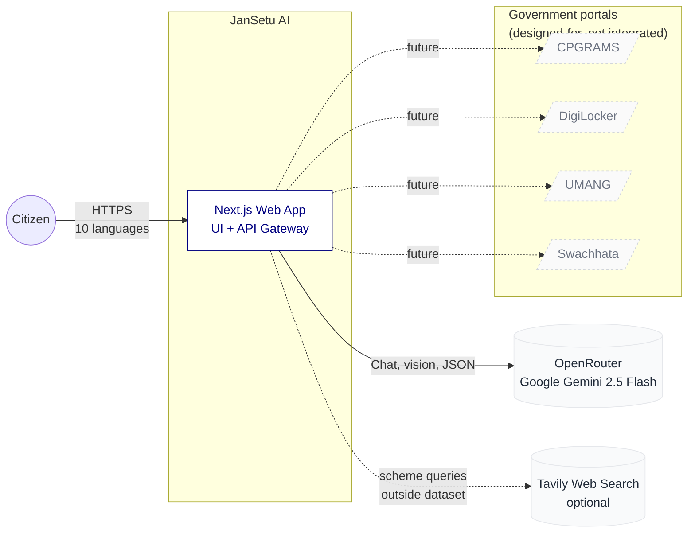
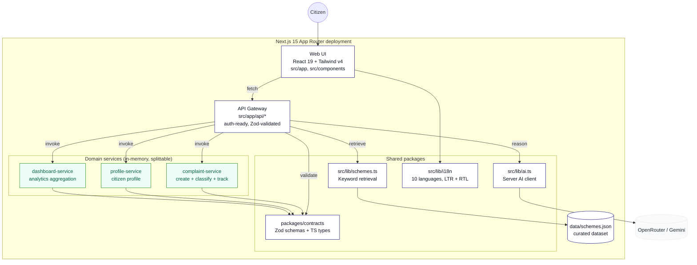
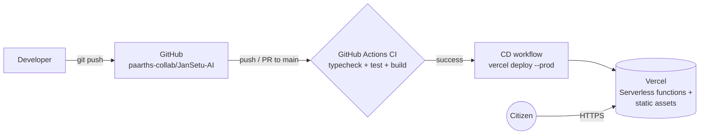

# High-Level Architecture

This document describes JanSetu AI at the "system context" and "container" levels: what the pieces are, how they relate, and why they were chosen. See [`architecture-low-level.md`](./architecture-low-level.md) for module-level detail and [`functioning.md`](./functioning.md) for user flow sequence diagrams.

## System context

The citizen interacts with JanSetu AI through a browser. The application depends on one AI provider for language reasoning and, optionally, a web-search provider as a fallback for queries outside the curated dataset. Government portals are named in the context because they define the problem space; JanSetu is designed to integrate with them, but does not do so in this MVP.

## Container view

Inside the deployed application, five logical containers cooperate. They live in one Next.js codebase (one deployable), but the seams are real: each container owns its files, its dependencies, and its tests.

### Container responsibilities

| Container | Responsibility | Key files |
|---|---|---|
| **Web UI** | Landing, service hub, chat, scheme finder, report, tracking, dashboard. Manages the active language and RTL direction. | `src/app/**/page.tsx`, `src/components/*` |
| **API gateway** | Next.js route handlers that validate input against Zod contracts, invoke domain services, and orchestrate the AI layer. | `src/app/api/*/route.ts` |
| **Shared packages** | Contracts (`packages/contracts`), AI client (`src/lib/ai.ts`), retrieval (`src/lib/schemes.ts`), i18n (`src/lib/i18n.tsx`). Consumed by both UI and gateway. | `src/lib/*`, `packages/contracts/*` |
| **Domain services** | Complaint, profile, dashboard. Pure TypeScript classes with in-memory repositories and their own unit tests. Splittable to independent HTTP services later. | `services/*/src/*.ts` |
| **Data** | Static JSON of real Indian government schemes (`schemes.json`). Loaded server-side and reasoned over as plain text. No vector store. | `data/schemes.json` |

## Key design decisions

### 1. Action-first, not portal-clone

JanSetu positions itself as the AI action-layer that unifies functions today spread across siloed portals. The MVP scope is deliberately six modules that cover the judging rubric end to end. Real portal integration is stated explicitly as future work.

### 2. Logical microservices in one deployable

Splitting services into their own runtimes has real integration cost (network, deploys, orchestration). At MVP scale, a single Next.js deployable with well-boundaried domain services under `services/*` gives the architectural clarity of microservices without paying the operational cost. Each service owns its files, has its own unit tests, and communicates only through Zod contracts, so promotion to independent HTTP services later is a mechanical change, not a rewrite.

### 3. No vectors. Text and JSON only.

Vector databases add operational complexity for negligible benefit at this scale (single-digit-hundreds of schemes). The scheme finder uses keyword and structured-field retrieval over `data/schemes.json`, then hands the matching schemes to the LLM as reference text. It is transparent, reproducible, and demos identically every run.

### 4. Ten languages, live-switching, LTR and RTL

The active language is a client-side context (`src/lib/i18n.tsx`) persisted to `localStorage` and passed with every chat request. The system prompt tells the LLM to reply in the active language. Urdu switches the `dir` attribute to `rtl`. Static UI strings are looked up in `src/lib/i18n-dict.ts`; the chat operates natively in whichever language it is asked to.

### 5. Graceful degradation

The system prompt tells the model to reply in the active language, but the app is designed so every module remains functional without any API key: schemes falls back to the dataset, complaints classify via keyword rules, chat returns a friendly placeholder. This is critical for demos and for judging environments where secrets are not injected.

### 6. Zod contracts as the seam

Every cross-boundary payload (API bodies, service arguments, LLM structured outputs) is validated at runtime with Zod. The compiled TypeScript types are derived from the schemas, so a change in one propagates to both.

## Non-functional attributes

| Attribute | Approach |
|---|---|
| **Multilingual** | 10-language UI dictionary plus LLM-native answers in any language. Urdu RTL supported. |
| **Accessibility** | Semantic HTML, ARIA labels, keyboard-navigable controls, high-contrast tricolor palette. |
| **Security** | Server-only secrets, Zod input validation, `rehype-sanitize` on rendered markdown, no `dangerouslySetInnerHTML`, security headers via `next.config.ts`, rate limiting on API routes. |
| **Performance** | Static prerendering for landing and service pages, dynamic rendering for API routes, chunk-split client bundles under 230 kB first-load JS. |
| **Testability** | Domain services and contracts are pure TypeScript with Vitest suites. API routes have integration tests that invoke the exported handlers directly. |
| **Portability** | Single deployable, single toolchain, works on any Node 20+ host. Vercel is the default target. |

## Deployment topology

- **CI** runs on every push and PR to `main` (`.github/workflows/ci.yml`).
- **CD** runs on push to `main` (`.github/workflows/deploy.yml`) and no-ops until `VERCEL_TOKEN`, `VERCEL_ORG_ID`, and `VERCEL_PROJECT_ID` are set as repository secrets.
