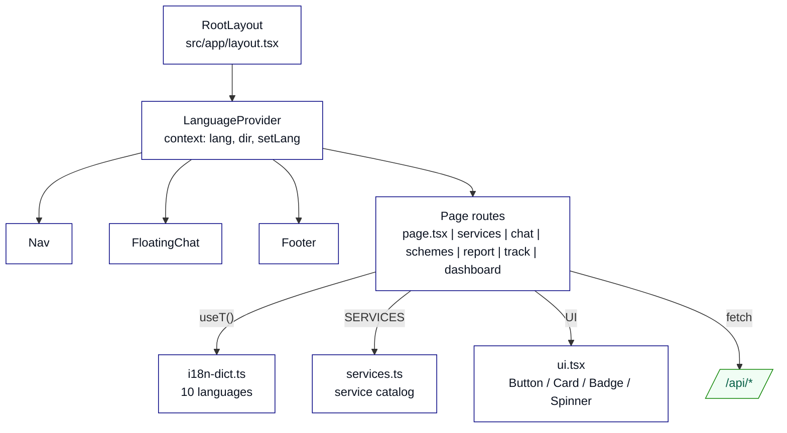
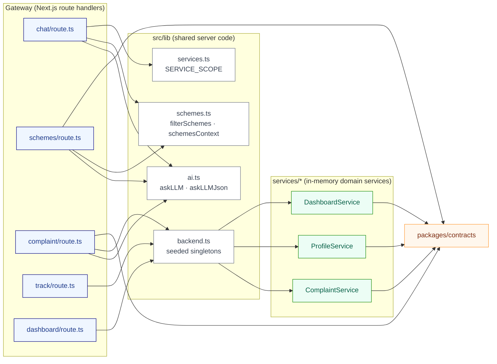
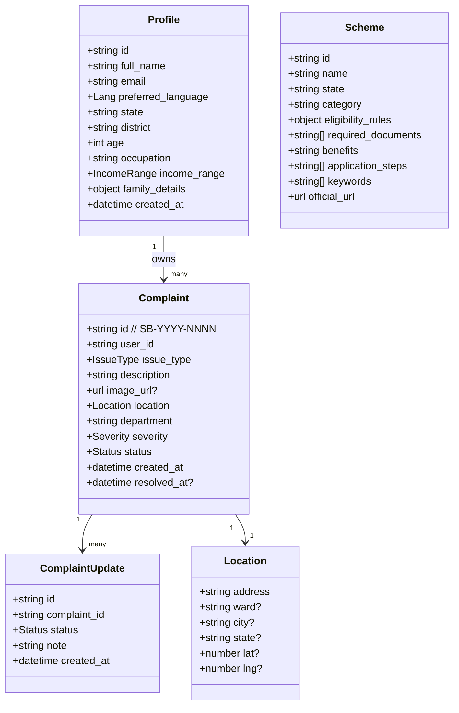
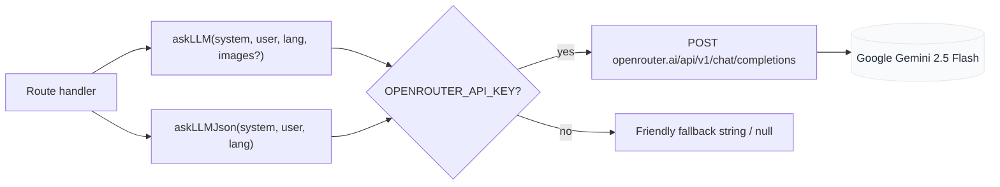

# Low-Level Architecture

Module-level design of JanSetu AI. Read [`architecture-high-level.md`](./architecture-high-level.md) first for context. See [`functioning.md`](./functioning.md) for how these modules are wired together in each user-facing flow.

## Directory layout

```
JanSetu-AI/
├── src/
│   ├── app/                        Next.js App Router
│   │   ├── layout.tsx              Root layout, LanguageProvider, Nav, FloatingChat, footer
│   │   ├── globals.css             Tailwind v4 tokens, tricolor helpers, RTL support
│   │   ├── page.tsx                Landing (hero + service grid + how-it-works + about)
│   │   ├── services/page.tsx       Services hub (six cards)
│   │   ├── chat/page.tsx           Multimodal chat, service-scoped
│   │   ├── schemes/page.tsx        Scheme finder
│   │   ├── report/page.tsx         Photo + description complaint form
│   │   ├── track/page.tsx          Complaint list + timeline
│   │   ├── dashboard/page.tsx      Transparency analytics (Recharts)
│   │   └── api/
│   │       ├── chat/route.ts       POST — multimodal chat with PDF text extraction
│   │       ├── schemes/route.ts    POST — dataset retrieval + AI reasoning
│   │       ├── complaint/route.ts  POST — image-classified complaint creation
│   │       ├── track/route.ts      GET  — list or fetch one complaint + timeline
│   │       └── dashboard/route.ts  GET  — aggregated analytics
│   ├── components/
│   │   ├── Nav.tsx                 Sticky nav with tricolor bar + language switcher
│   │   ├── Logo.tsx                Original Ashoka-chakra-inspired mark (not the State Emblem)
│   │   ├── FloatingChat.tsx        Persistent chat launcher on every page
│   │   └── ui.tsx                  Button, Card, Badge, Spinner primitives
│   └── lib/
│       ├── i18n.tsx                LanguageProvider, useLang, useT
│       ├── i18n-dict.ts            10-language UI dictionary
│       ├── services.ts             Service catalog (id, icon, accent, scope prompt)
│       ├── contracts.ts            Re-export of packages/contracts
│       ├── ai.ts                   Server AI client (askLLM, askLLMJson, hasAI)
│       ├── schemes.ts              Text/JSON retrieval helpers
│       ├── backend.ts              Seeded singletons (complaint/profile/dashboard)
│       └── cn.ts                   class-merge helper
├── packages/
│   └── contracts/src/index.ts      Zod schemas + inferred TS types
├── services/
│   ├── complaint-service/          Class + in-memory repo + tests
│   ├── profile-service/            Class + in-memory repo + tests
│   ├── dashboard-service/          Class + tests
│   └── contracts-validation.test.ts
├── data/schemes.json               Curated dataset of Indian government schemes
├── docs/                           This documentation
└── .github/workflows/              CI (typecheck + test + build) and CD (Vercel)
```

## Frontend components



## Backend modules

The gateway (API route handlers under `src/app/api/*`) is a thin orchestration layer. It validates input against Zod contracts, calls domain services, and combines the results with AI reasoning where useful.



## Data model

Zod schemas in `packages/contracts/src/index.ts` are the single source of truth. TS types are inferred with `z.infer<typeof Schema>`. In-memory repositories in the domain services persist objects at runtime; the shape below matches what a real database would store.



Enumerations declared in the same file:

| Enum | Values |
|---|---|
| `Lang` | `en, hi, mr, gu, ta, kn, te, bn, pa, ur` |
| `ServiceId` | `schemes, documents, complaints, tracking, ask` |
| `IssueType` | `garbage, pothole, streetlight, water_supply, drainage, noise, other` |
| `Severity` | `low, medium, high` |
| `Status` | `submitted, under_review, assigned, in_progress, resolved, rejected` |
| `IncomeRange` | `below_1_lakh, 1_to_3_lakh, 3_to_6_lakh, above_6_lakh, unknown` |

## API surface

All routes live under `src/app/api/*/route.ts`, run on the Node.js runtime, and are dynamic (`force-dynamic`). Bodies and responses are Zod-validated in and out.

| Method | Path | Purpose | Request | Response |
|---|---|---|---|---|
| `POST` | `/api/chat` | Multimodal service-scoped chat | `{ messages, service, lang, images?, pdfs? }` | `{ reply: string }` |
| `POST` | `/api/schemes` | AI scheme recommendations with dataset fallback | `{ query, lang }` | `{ recommended: [{ name, reason, documents, steps, url }], aiUsed }` |
| `POST` | `/api/complaint` | Create complaint from text (+ optional photo) | `{ text, imageDataUrl?, location, lang }` | `{ complaint, note }` |
| `GET` | `/api/track` | List all citizen's complaints | (no body) | `{ complaints: Complaint[] }` |
| `GET` | `/api/track?id=SB-YYYY-NNNN` | Complaint detail + timeline | (no body) | `{ complaint, updates }` or `404` |
| `GET` | `/api/dashboard` | Aggregated analytics | (no body) | `{ totals, byDepartment, byStatus, byWard, avgResolutionDays }` |

## Domain services

Each service is a class in `services/<name>/src/<name>Service.ts` with a plain in-memory repository, deterministic behavior, and its own Vitest suite. `src/lib/backend.ts` instantiates them once, seeds demo data, and re-exports the singletons so route handlers can use them.

### ComplaintService

```mermaid
classDiagram
    class InMemoryComplaintRepository {
        -Map~string, Complaint~ complaints
        -Map~string, ComplaintUpdate[]~ updates
        +insert(complaint, initialUpdate) Complaint
        +getById(id) Complaint?
        +listByUser(userId) Complaint[]
        +listAll() Complaint[]
        +updatesFor(id) ComplaintUpdate[]
        +addUpdate(update) ComplaintUpdate
    }

    class ComplaintService {
        -sequence int
        +createForUser(userId, input) Complaint
        +trackForUser(userId, id) {complaint, updates}
        +listForUser(userId) Complaint[]
        +listAllForDashboard() Complaint[]
        +transition(id, status, note) ComplaintUpdate
    }

    ComplaintService --> InMemoryComplaintRepository
```

`classifyComplaint(text)` maps keyword patterns to `{ issue_type, department, severity }`. It is deterministic and testable without the AI. The AI's role in the complaint route is to enrich the description from an uploaded image before classification runs.

### ProfileService and DashboardService

`ProfileService` is a thin upsert-and-fetch wrapper over an in-memory map. `DashboardService.summarize(complaints[])` reduces a complaint list to `{ totals, byDepartment, byStatus, byWard, avgResolutionDays }`. Both are pure functions of their inputs and are covered by unit tests.

## AI layer

`src/lib/ai.ts` is the server-side AI client. It targets OpenRouter with the OpenAI-compatible Chat Completions API and defaults to `google/gemini-2.5-flash`, which supports vision and multilingual reasoning.



Key properties:

- Deterministic system prompt: base civic-assistant instructions plus a service scope from `SERVICE_SCOPE[service]` plus `"Always respond ONLY in ${languageName(lang)}"`.
- Multimodal: images are attached as `image_url` parts with data URLs; PDFs are extracted to text server-side with `unpdf` and injected into the user message.
- Structured mode: `askLLMJson` requests `response_format: { type: "json_object" }` and parses the result.
- No network in tests: without `OPENROUTER_API_KEY` the client returns a friendly fallback so tests and demos work offline.

## Retrieval

`src/lib/schemes.ts` loads `data/schemes.json` and provides two functions:

- `filterSchemes(query, limit)` — tokenizes the query, scores each scheme by keyword and field overlap, returns the top matches (or all schemes if the query yields no signal).
- `schemesContext(schemes)` — formats a compact reference block that the LLM can reason over: name, state, category, benefits, eligibility rules, documents, steps, official URL.

This gives the AI the exact facts it needs without a vector store, and lets the route fall back to deterministic recommendations when the AI is unavailable.

## Internationalization

`src/lib/i18n.tsx` provides a React context with `{ lang, setLang, dir }`. `useT()` returns a translator that looks up `key` in the active language's slice of `TRANSLATIONS`, falling back to English, then to the caller's `fallback`. The provider persists `lang` to `localStorage` under `jansetu.lang` and mirrors `lang` and `dir` onto `<html>`.

For the chat, the active language is sent with every request. The system prompt tells the model to reply in that language, so switching mid-conversation makes the next assistant message appear in the new language.

## Security

Chosen for reasonableness at MVP scale; production hardening would layer real auth on top.

- Server-only secrets (`OPENROUTER_API_KEY`, `TAVILY_API_KEY`) are only read in server code and never leak to the client bundle.
- Every request body is validated with Zod before it reaches domain logic.
- Rendered assistant markdown passes through `rehype-sanitize`, so injected HTML cannot execute.
- No `dangerouslySetInnerHTML` is used anywhere in the app.
- Security headers (CSP, HSTS, X-Content-Type-Options, X-Frame-Options, Referrer-Policy, Permissions-Policy) are set at the framework layer.
- File uploads are validated for MIME type, size, and magic-byte prefix on the server; anything that fails is rejected.
- Rate limiting is applied per client IP on API routes to protect the AI budget and prevent abuse.

## Testing strategy

| Layer | Tool | What it covers |
|---|---|---|
| Contracts | Vitest | Zod schemas parse valid input and reject invalid input for every enum, ID pattern, and shape. |
| Domain services | Vitest | Complaint classification, status transitions, dashboard aggregation, profile upsert. Pure inputs, pure outputs. |
| API routes | Vitest | Invoke the exported `POST`/`GET` handlers directly with a `Request`; assert the response shape and status. No network. |
| Build | `next build` | Compiles all pages and API routes. Runs on every push and PR to `main`. |
| Type safety | `tsc --noEmit` | Whole-project typecheck. Runs on every push and PR. |

## Configuration

All runtime configuration is via environment variables. `next.config.ts` adds a bundler extension alias so imports written with `.js` specifiers (used by the domain services under `services/*`) resolve to the TypeScript sources.

| Variable | Default | Notes |
|---|---|---|
| `OPENROUTER_API_KEY` | (unset) | Enables live AI. |
| `OPENROUTER_MODEL` | `google/gemini-2.5-flash` | Override the model. |
| `TAVILY_API_KEY` | (unset) | Enables the web-search fallback for schemes. |
| `NODE_ENV` | `production` in Vercel | Controls asset caching and error verbosity. |
