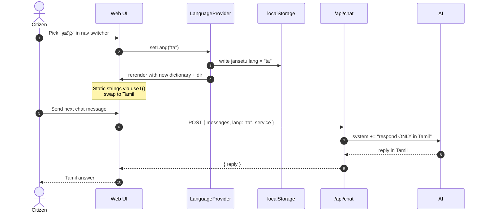
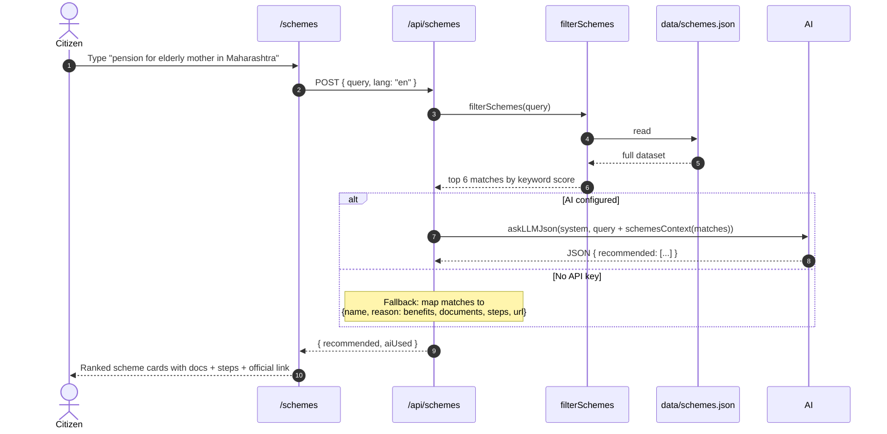
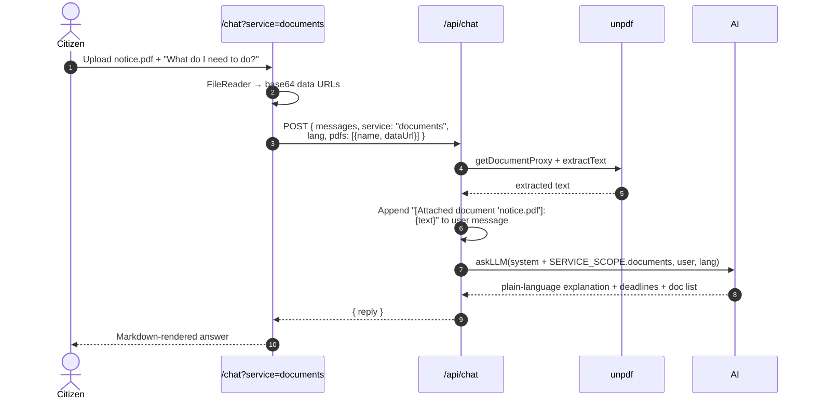
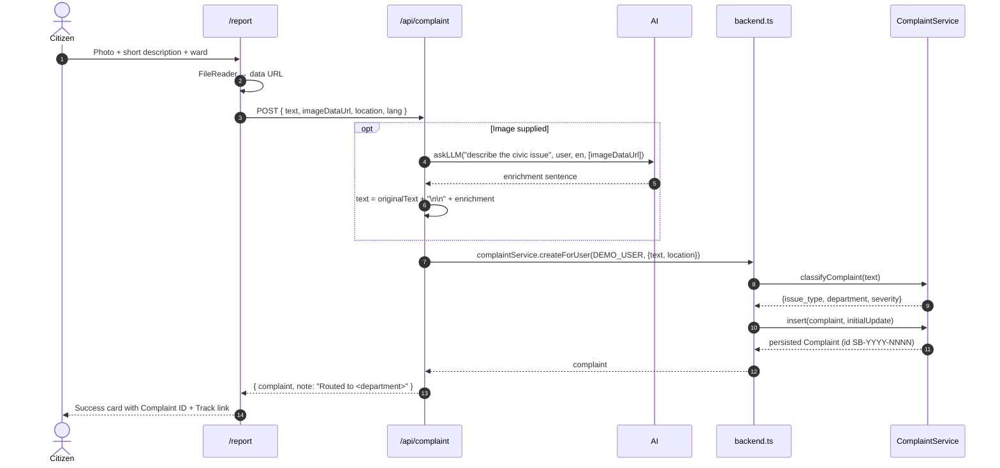
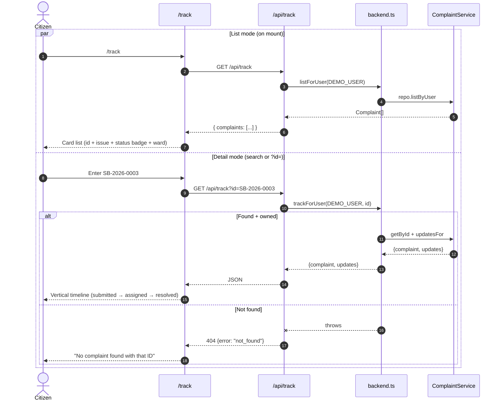
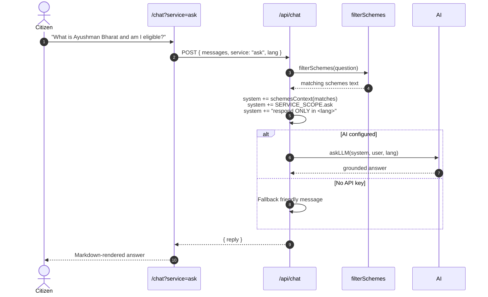
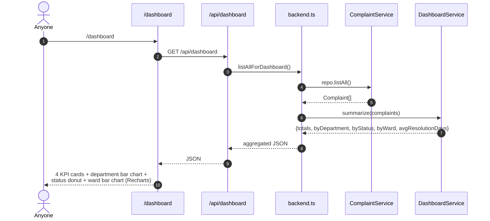
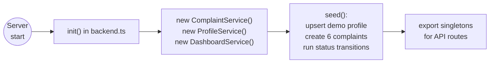

# Functioning and Flows

End-to-end sequence diagrams for every user-facing capability in JanSetu AI. Read [`architecture-high-level.md`](./architecture-high-level.md) for context and [`architecture-low-level.md`](./architecture-low-level.md) for module APIs.

Throughout, "Citizen" is the person in the browser, "UI" is the React client, "Gateway" is a Next.js API route handler, "AI" is `src/lib/ai.ts` calling OpenRouter, and "SchemesDS" and the domain services live server-side.

## Flow 0: language-follows-UI

The language toggle is not just cosmetic. It changes the language the AI answers in, live, mid-conversation.

Urdu additionally sets `dir="rtl"` on `<html>`, which flips the layout right-to-left across the whole app.

## Flow 1: Find a Scheme

The scheme finder wants two things at once: solid deterministic recommendations (dataset fallback) and better-quality reasoning (AI). Both live in the same route so the app is fully usable without an AI key.

## Flow 2: Document Requirements and Decoder

Two paths funnel into the same chat route, service-scoped to `documents`. Either the citizen asks in plain language ("what documents do I need for a birth certificate in Maharashtra?"), or they upload a government PDF and ask "what does this say?".

Images (vision) travel differently: they are attached as `image_url` parts on the LLM message rather than pre-extracted. Both attachment types are supported in the same request.

## Flow 3: Report a Public Issue

Photo optional but strongly encouraged. When present, the AI enriches the citizen's short text with what it sees in the image before the deterministic keyword classifier picks a department and severity.

Note the deliberate separation: the AI helps *describe*, the deterministic classifier decides *routing*. This makes the routing reproducible and testable without the AI.

## Flow 4: Track a Complaint

Two entry points to the same handler: list mode when the citizen lands with no ID, and detail mode when they type or link to one.

## Flow 5: Ask Anything

The catch-all service. The route enriches the user's question with matching scheme context (so answers about schemes are grounded in the dataset) and lets the AI answer in plain language.

If the user attaches an image or PDF, the same paths from Flow 2 apply.

## Flow 6: Transparency Dashboard

Public, aggregate view over all complaints in the system. In this MVP that means the seeded dataset plus anything the citizen has just filed.

## Bootstrapping and seed data

`src/lib/backend.ts` runs once per server process, wires up the three domain services, seeds a demo citizen and six varied complaints across Pune wards and departments, and drives a couple of status transitions so the dashboard and timeline demo well. Storage is in-memory; each cold start reseeds.

## What is not built in this MVP

Called out explicitly here so that anyone reading this document knows the boundary:

- No real user auth. Every request runs as `DEMO_USER`. The data model has `user_id` throughout so real auth drops in cleanly.
- No real portal submission. Complaints are stored in-memory only. Designed-for integrations: CPGRAMS (grievance submission and appeal), DigiLocker (document store), UMANG (service endpoints).
- No SMS or WhatsApp channel. Web only for this hackathon.
- No vector store. Retrieval is keyword and field-based over `data/schemes.json`.
